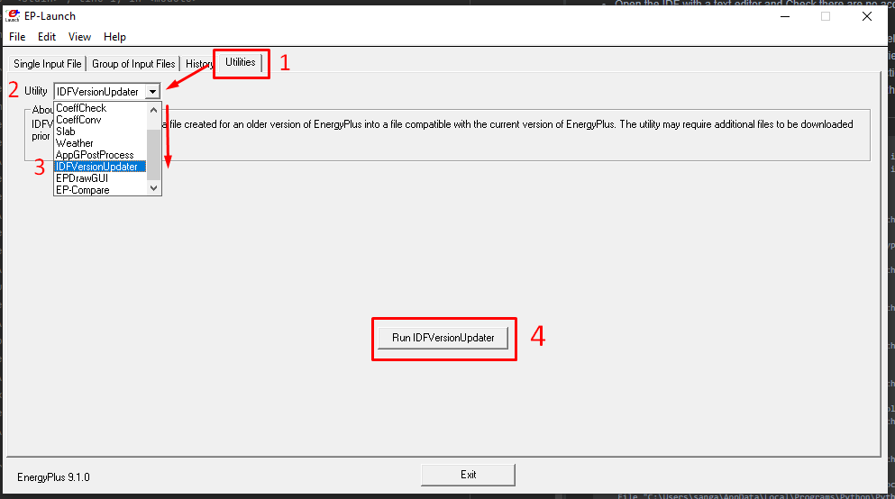

# 4. Troubleshooting
## 4.1 Errors you might get
Below you can see a few errors you might get when trying to run `addAccis()`:

________________________
`ModuleNotFoundError: No module named 'numpy'
`

You need to update the numpy package. To do so, you just need to open cmd and enter:

`pip install numpy --upgrade`

________________________

`UnicodeEncodeError: 'latin-1' codec can't encode character '\u0144' in position
 123174: ordinal not in range(256)
`

This error means that there are some unconventional characters within the model. To amend this problem, try the following:

- Open the IDF with a text editor and Check there are no accents or other unconventional characters such as 'ñ'. For example, you can try replacing all instances of 'á' with 'a'.
- If it doesn't work and you are using Designbuilder to model the building, then you can try opening a new file, then importing the building geometry to the new file, exporting only libraries used from the old model  (it is recommended to carefully check that all inherent data, from schedules to profiles, constructions and materials within these libraries are in English), and finally importing these to the new model and assigning them to the relevant objects as needed.

________________________

```
this node -WINDOWPROPERTY:SHADINGCONTROL-is not present in base dictionary
this node -WINDOWPROPERTY:SHADINGCONTROL-is not present in base dictionary
1 <class 'int'> None <class 'NoneType'>
Traceback (most recent call last):
  File "<stdin>", line 1, in <module>
  File "C:\Users\sanga\AppData\Local\Programs\Python\Python39\lib\site-packages
\accim\sim\accis.py", line 138, in addAccis
    z = accim_Main.accimJob(filename_temp=file, ScriptType=ScriptType, EnergyPl
us_version=EnergyPlus_version, verboseMode=verboseMode)
  File "C:\Users\sanga\AppData\Local\Programs\Python\Python39\lib\site-packages
\accim\sim\accim_Main.py", line 66, in __init__
    self.idf0 = IDF(fname1)
  File "C:\Users\sanga\AppData\Local\Programs\Python\Python39\lib\site-packages
\eppy\modeleditor.py", line 548, in __init__
    self.read()
  File "C:\Users\sanga\AppData\Local\Programs\Python\Python39\lib\site-packages
\eppy\modeleditor.py", line 672, in read
    readout = idfreader1(
  File "C:\Users\sanga\AppData\Local\Programs\Python\Python39\lib\site-packages
\eppy\idfreader.py", line 307, in idfreader1
    bunchdt = makebunches_alter(data, commdct, theidf, block)
  File "C:\Users\sanga\AppData\Local\Programs\Python\Python39\lib\site-packages
\eppy\idfreader.py", line 109, in makebunches_alter
    bobj = makeabunch(commdct, obj, obj_i, block=block)
  File "C:\Users\sanga\AppData\Local\Programs\Python\Python39\lib\site-packages
\eppy\idfreader.py", line 68, in makeabunch
    extlst = extension_of_extensible(commdct[obj_i], block[obj_i], n)
  File "C:\Users\sanga\AppData\Local\Programs\Python\Python39\lib\site-packages
\eppy\idfreader.py", line 332, in extension_of_extensible
    n = n // ext
TypeError: unsupported operand type(s) for //: 'int' and 'NoneType'
```

If you get an error similar to the one above, you are probably trying to run `addAccis()` with an IDF whose EnergyPlus version is 8.9 or older. To solve this problem, you need to update the IDF's EnergyPlus version up to some 9.X.X version. It is recommended to update up to the latest. To do so, you need to run EP-Launch, go to the Utilities tab, look for and select IDFversionUpdater; run IDFVersionUpdater; then choose the file to update, select the new version and finally update file.




________________________

## 4.2 General recommendations

If you are using only one version of Python in your computer, you should check on the option 'Add to PATH'. Otherwise, the python interpreter won't be able to find the accis package.


