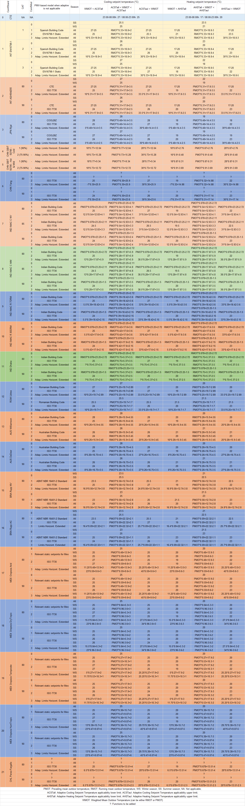

# How to use
## First steps
There has been developed 3 main branches of functions, which are:

- VRFsystem: Adds standard VRF systems for each occupied zone and applies the adaptive or PMV-based setpoint temperatures.

- ExistingHVAC only with full air-conditioning mode: Keeps the existing HVAC systems and modify the existing setpoint temperatures to adaptive or PMV-based setpoint temperatures. However, mixed-mode and naturally ventilated modes are not available in this mode. 

- ExistingHVAC with mixed mode: UNDER DEVELOPMENT. IT IS NOT ADVISABLE TO USE IT YET. Keeps the existing HVAC systems and modify the existing setpoint temperatures to adaptive or PMV-based setpoint temperatures, considering mixed-mode. In order to properly work, there must be only one object for heating and another for cooling that can be used to monitor if these are turned on at any timestep (such as `Coil:Cooling:Water` and `Coil:Heating:Water`). Also, these objects must be named following the pattern "Zone name" "Object name". For instance, an `Coil:Heating:Electric` object could be named `Block1:Zone1 PTAC Heating Coil`, given that `Block1:Zone1` is a valid zone name. On the other hand, a `Coil:Cooling:Water` object named `Main Cooling Coil 1` would not be valid, since in this case the room would be `Main`; this is the typical case of some equipment shared by multiple rooms. If this condition is not met, accim will not generate the output IDF files for that input IDF file. For instance, if there are `Coil:Heating:Electric` and `Coil:Heating:DX:SingleSpeed` objects in the same model, simulation will crash. Also, if there is just an `ZoneHVAC:Baseboard:RadiantConvective:Water` used for heating, and cooling is not monitored, simulation will also crash.

Therefore, if you are going to use the VRFsystem script, you're supposed to have one or multiple IDFs with fixed setpoint temperature, or even without any HVAC objects at all (it doesn't matter, since the module is going to add a standard VRF system for each zone, and the simulation is going to be calculated with these VRF systems), and with Calculated Natural Ventilation if you're going to use the Mixed Mode.
On the other hand, if you are going to use any ExistingHVAC script, again you're supposed to have one or multiple IDFs, however in this case there must be a fully functional HVAC system. Therefore, you must be able to successfully run a simulation with fixed setpoint temperatures in order for the accim package to work. The main difference between ExistingHVAC only with full air-conditioning and with mixed mode is that in the latter, the existing HVAC system needs to be mapped in order to monitor if it needs to be activated or not, and windows need to be actuated in case conditions for natural ventilation are favourable.

By using any ExistingHVAC script you might not get the results that you expect, even if there are no errors in the accim and simulation processes. The reason lies on the HVAC system itself, and that is why the VRFsystem script has been developed, because it has been tested that it works. 

No matter what type or functions are you going to use, the language of the software used to create the input IDF should be English (for example, if you use Designbuilder in Spanish, accim won't work properly), and it's not recommended to use any non-standard characters in the input IDF, just like written accents or "ñ".

Said that, accim will transform all the IDF files located in the same path where script is. Therefore, the quickest way to run the script is opening a prompt command dialog in the folder where the IDF files are located (you can do this by holding Ctrl and right-click inside the folder, and click on 'open PowerShell window here'). Then run Python by typing 'python' in the command prompt.

First you need to import the module 'accis' (stands for Adaptive Comfort Control Implementation Script):
```
>>> from accim.sim import accis
```
And then, you just need to call the accis function:
```
>>> accis.addAccis()
```
Then you'll be asked in the prompt to enter some information so that python knows how do you want to set up the output IDFs:
```
Enter the ScriptType (for VRFsystem: vrf; for ExistingHVAC with mixed mode: ex_mm; or for ExistingHVAC only with full air-conditioning mode: ex_ac): vrf
Enter the Output (standard, simplified or timestep): standard
Enter the EnergyPlus version (ep91 to ep96): ep96
Enter the Temperature Control method (temperature or pmv): temperature
```
where
- ScriptType can be 'vrf', 'ex_mm' or 'ex_ac', and it refers to the type of functions as explained above
- Outputs can be 'standard', 'simplified' or 'timestep', and it refers to the simulation results: 'standard' means that results will contain the full selection; 'simplified' means that results are just going to be the hourly operative temperature and VRF consumption of each zone, mainly used when you need the results not to be heavy files, because you are going to run a lot of simulations and capacity is limited; and 'timestep' means that results are going to be the full selection in Timestep frequency, so this is only recommended for tests, or small number of simulations.
- EnergyPlus_version can be 'ep91', 'ep92', 'ep93', 'ep94', 'ep95' or 'ep96'. It is the version of EnergyPlus you have installed in your computer. If you enter 'ep91', accim will look for the E+9.1.0 IDD file in path "C:\\EnergyPlusV9-1-0".
- Temperature Control method can be 'temperature' or 'temp', or 'pmv'. If 'temp' is used, the setpoint will be the operative temperature, otherwise if 'pmv' is used, the setpoint will be the PMV index.

Besides, `addAccis()` can take the same values we entered before in the prompt command as arguments. The usage of this function will be detailed below. An example of this, to get the same results as shown in the command prompt would be:
```
>>> accis.addAccis('vrf','standard','ep96', 'temp')
```
accis will show on the prompt command dialog all the objects it adds, and those that doesn't need to be added because were already in the IDF, and finally ask you to enter some values to set up the IDFs as you desire. Please refer to the section titled 'Setting up the target IDFs'.

Once you run the simulations, you might get some EnergyPlus warnings and severe errors. This is something I'm currently working on.

## Setting up the target IDFs


If you run `accis.addAccis(whateverScriptType, whateverOutputs, whateverEPversion, whateverTempCtrl)`, you will be asked in the prompt to enter a few values separated by space to set up the desired IDFs. However, you can also skip the command prompt process by running accis directly including the arguments in the function, whose usage would be:
```
>>> accis.addAccis(str, # ScriptType: 'vrf', 'ex_mm', 'ex_ac'
>>>                str, # Outputs: 'simplified', 'standard' or 'timestep'
>>>                str, # EnergyPlus_version: 'ep91', 'ep92', 'ep93', 'ep94', 'ep95' or 'ep96'
>>>                str, # TempCtrl: 'temperature' or 'temp', or 'pmv'
>>>                list, # ComfStand, which is the Comfort Standard
>>>                list, # CAT, which is the Category
>>>                list, # ComfMod, which is Comfort Mode
>>>                list, # HVACmode, which is the HVAC mode
>>>                list, # VentCtrl, which is the Ventilation Control
>>>                list, # VSToffset
>>>                list, # MinOToffset
>>>                list, # MaxWindSpeed
>>>                float, # ASTtol start
>>>                float, # ASTtol end
>>>                float, # ASTtol steps
>>>                str # NameSuffix: some text you might want to add at the end of the output IDF file name
>>>                bool # verboseMode: True to print all process in screen, False to not to print it. Default is True.
>>>                bool # confirmGen: True to confirm automatically the generation of IDFs; if False, you'll be asked to confirm in command prompt. Default is False. 
>>>                )
```
Some example of the usage could be:
```
>>> accis.addAccis(ScriptType='vrf', # ScriptType: 'vrf', 'ex_mm', 'ex_ac'
>>>                Outputs='standard', # Outputs: 'simplified', 'standard' or 'timestep'
>>>                EnergyPlus_version='ep95', # EnergyPlus_version: 'ep91', 'ep92', 'ep93', 'ep94','ep95' or 'ep96'
>>>                TempCtrl='temp', # Temperature Control: 'temperature' or 'temp', or 'pmv'
>>>                ComfStand=[0, 1, 2, 3], # ComfStand, which is the Comfort Standard
>>>                CAT=[1, 2, 3, 80, 90], # CAT, which is the Category
>>>                ComfMod=[0, 1, 2, 3], # ComfMod, which is Comfort Mode
>>>                HVACmode=[0, 1, 2], # HVACmode, which is the HVAC mode
>>>                VentCtrl=[0, 1], # VentCtrl, which is the Ventilation Control
>>>                VSToffset=[0, 1, 2], # VSToffset, which is the Ventilation Setpoint Temperature offset
>>>                MinOToffset=[0, 1, 2], # MinOToffset, which is the Minimum Outdoor Temperature offset
>>>                MaxWindSpeed=[10, 20, 30], # MaxWindSpeed, which is th Maximum Wind Speed
>>>                ASTtol_start=0, # ASTtol_start, which is the start of the tolerance sequence
>>>                ASTtol_end_input=2, # ASTtol_end_input, which is the end of the tolerance sequence
>>>                ASTtol_steps=0.25, # ASTtol_steps, which are the steps of the tolerance sequence
>>>                NameSuffix='standard' # Name Suffix: for example, just in case you want to clarify the outputs
>>>                )
```
If you specify the arguments when you call the function, you need to specify at least: ScriptType, Outputs, EnergyPlus_version, TempCtrl, ComfStand, CAT, ComfMod, HVACmode and VentCtrl. For clarity purposes, it's recommended to specify the argument name as well, as shown above. If you don't specify all aforementioned arguments, you'll be ask to enter them at the prompt command, and these values will be used instead of those specified in the function call.
Each argument is explained below:

- ComfStand: refers to the thermal comfort standard or model to be applied. Enter any number from 0 to 16 to select the comfort standard or model to be used; you can see which model is each number in the table below. Readthedocs doesn't render it properly, so please take a look at the [Github repository](https://github.com/dsanchez-garcia/accim/blob/master/docs/how%20to%20use.md). For example, if you enter '0 1 2 3', you'll get IDFs for CTE, EN16798-1, ASHRAE 55 and the local model developed by Rijal et al for Japanese dwellings. If you don't enter any number, or if some of the numbers entered are not 0, 1, 2 or 3, it'll ask you to enter the numbers again.

| ComfStand No. | ComfStand Name | Area | Reference  |
|:--- |:--- |:--- |:--- |
| 0 | CTE | Spain | The Government of Spain. Royal Decree 314/2006. Approving the Spanish Technical Building Code CTE-DB-HE-1 2013:1–43. https://www.boe.es/eli/es/rd/2006/03/17/314 (accessed August 6, 2021).  |
| 1 | EN16798-1 | Europe | European committee for standardization. EN 16798-1:2019 Energy performance of buildings. Ventilation for buildings. Indoor environmental input parameters for design and assessment of energy performance of buildings addressing indoor air quality, thermal environment, lighting and acoustics. 2019. https://en.tienda.aenor.com/norma-bsi-bs-en-16798-1-2019-000000000030297474 (accessed August 6, 2021).  |
| 2 | ASHRAE 55 | Worldwide | ASHRAE Standard 55-2020 Thermal Environmental Conditions for Human Occupancy, ASHRAE Standard (2020).  |
| 3 | JPN·Rijal | Japan | Rijal, H. B., Humphreys, M. A., & Nicol, J. F. (2019). Adaptive model and the adaptive mechanisms for thermal comfort in Japanese dwellings. Energy and Buildings, 202, 109371. https://doi.org/10.1016/j.enbuild.2019.109371  |
| 4 | GBT50785·Cold | China | MOHURD, Evaluation Standard for Indoor Thermal Environment in Civil Buildings (GB/T 50785-2012), Ministry of Housing and Urban-Rural Development (MOHURD), Beijing, China, 2012.  |
| 5 | GBT50785·HotMild | China | MOHURD, Evaluation Standard for Indoor Thermal Environment in Civil Buildings (GB/T 50785-2012), Ministry of Housing and Urban-Rural Development (MOHURD), Beijing, China, 2012.  |
| 6 | CHN·Yang | China | Yang, L., Fu, R., He, W., He, Q., & Liu, Y. (2020). Adaptive thermal comfort and climate responsive building design strategies in dry–hot and dry–cold areas: Case study in Turpan, China. Energy and Buildings, 209, 109678. https://doi.org/10.1016/j.enbuild.2019.109678  |
| 7 | IMAC·C·NV | India | Manu, S., Shukla, Y., Rawal, R., Thomas, L. E., & de Dear, R. (2016). Field studies of thermal comfort across multiple climate zones for the subcontinent: India Model for Adaptive Comfort (IMAC). Building and Environment, 98, 55–70. https://doi.org/10.1016/j.buildenv.2015.12.019  |
| 8 | IMAC·C·MM | India | Manu, S., Shukla, Y., Rawal, R., Thomas, L. E., & de Dear, R. (2016). Field studies of thermal comfort across multiple climate zones for the subcontinent: India Model for Adaptive Comfort (IMAC). Building and Environment, 98, 55–70. https://doi.org/10.1016/j.buildenv.2015.12.019  |
| 9 | IMAC·R·7DRM | India | Rawal, R., Shukla, Y., Vardhan, V., Asrani, S., Schweiker, M., de Dear, R., Garg, V., Mathur, J., Prakash, S., Diddi, S., Ranjan, S. V., Siddiqui, A. N., & Somani, G. (2022). Adaptive thermal comfort model based on field studies in five climate zones across India. Building and Environment, 219, 109187. https://doi.org/10.1016/J.BUILDENV.2022.109187  |
| 10 | IMAC·R·30DRM | India | Rawal, R., Shukla, Y., Vardhan, V., Asrani, S., Schweiker, M., de Dear, R., Garg, V., Mathur, J., Prakash, S., Diddi, S., Ranjan, S. V., Siddiqui, A. N., & Somani, G. (2022). Adaptive thermal comfort model based on field studies in five climate zones across India. Building and Environment, 219, 109187. https://doi.org/10.1016/J.BUILDENV.2022.109187  |
| 11 | IND·Dhaka | India | Dhaka, S., Mathur, J., Brager, G., & Honnekeri, A. (2015). Assessment of thermal environmental conditions and quantification of thermal adaptation in naturally ventilated buildings in composite climate of India. Building and Environment, 86, 17–28. https://doi.org/10.1016/J.BUILDENV.2014.11.024  |
| 12 | ROM·Udrea | Romania | Udrea, I., Croitoru, C., Nastase, I., Crutescu, R., & Badescu, V. (2018). First adaptive thermal comfort equation for naturally ventilated buildings in Bucharest, Romania. International Journal of Ventilation, 17(3), 149–165. https://doi.org/10.1080/14733315.2017.1356057  |
| 13 | AUS·Williamson | Australia | Williamson, T., & Daniel, L. (2020). A new adaptive thermal comfort model for homes in temperate climates of Australia. Energy and Buildings, 210, 109728. https://doi.org/10.1016/j.enbuild.2019.109728  |
| 14 | AUS·DeDear | Australia | de Dear, R., Kim, J., & Parkinson, T. (2018). Residential adaptive comfort in a humid subtropical climate—Sydney Australia. Energy and Buildings, 158, 1296–1305. https://doi.org/10.1016/j.enbuild.2017.11.028  |
| 15 | BRA·Rupp·NV | Brazil | Rupp, R. F., de Dear, R., & Ghisi, E. (2018). Field study of mixed-mode office buildings in Southern Brazil using an adaptive thermal comfort framework. Energy and Buildings, 158, 1475–1486. https://doi.org/10.1016/J.ENBUILD.2017.11.047  |
| 16 | BRA·Rupp·AC | Brazil | Rupp, R. F., de Dear, R., & Ghisi, E. (2018). Field study of mixed-mode office buildings in Southern Brazil using an adaptive thermal comfort framework. Energy and Buildings, 158, 1475–1486. https://doi.org/10.1016/J.ENBUILD.2017.11.047  |


- CAT: refers to the category of the thermal comfort model applied. Most of the Comfort Standards work with 80 and 90% acceptability levels, except the European EN 16798-1 (works with Categories 1, 2 and 3), the Chinese GB/T 50785 (works with categories 1 and 2), and the India Model for Adaptive Comfort - Commercial (which works with 80, 85 and 90% acceptability levels). So, for example, if you are going to use the EN16798-1 (ComfStand = 1), you can enter '1 2 3' to generate setpoint temperatures for Categories 1, 2 and 3. Or, if you are going to use the IMAC Commercial in naturally ventilated mode (ComfStand = 7), you can enter '80 85 90' to generate setpoint temperatures for these acceptability levels. All categories are referenced in the full setpoint table at the end of this section, or directly at https://github.com/dsanchez-garcia/accim/blob/master/docs/img_1.png. Please note that the Category values must be consistent with the Comfort Standard values previously entered. If, for instance, you enter '1' in the Comfort Standard value (means you're asking for EN16798 model), but then enter '80' or '90' in the Category value (which are categories used in ASHRAE55), you won't get the results you want.

- ComfMod: is the Comfort Mode, and refers to the comfort modes used in accim. It controls if the setpoints are PMV-based (when ComfMod = 0) or adaptive (when ComfMod = 1, 2 or 3). When they are adaptive, it also controls the comfort model applied when the adaptive model is not applicable (that is, when the running mean outdoor temperature limits are exceeded), in which case a PMV-based model is applied. Each ComfMod for each ComfStand and CAT is referenced at the full list of setpoint temperatures at https://github.com/dsanchez-garcia/accim/blob/master/docs/images/full_table.png. Please refer to the research article https://www.mdpi.com/1996-1073/12/8/1498 for more information. Figure below shows the variation of setpoint temperatures when ComfMod 0 (upper left), 1 (upper right), 2 (lower left) and 3 (lower right), when ComfStand is 1 (EN 16798-1, although figure shows the superseded standard, but the setpoint behaviour is similar)


- HVACmode: refers to the HVAC mode applied. Enter 0 for Fully Air-conditioned, 1 for Naturally ventilated and/or 2 for Mixed Mode. Please note that Calculated natural ventilation must be enabled so that Mixed Mode works. So, for example, if you enter '0 1 2' you'll be getting all HVAC modes, or if you just enter '0 1' you'll be getting just Fully Air-conditioned and Naturally ventilated.

- VentCtrl: refers to the ventilation control, only used in Mixed Mode (HVAC Mode '2'). If you enter '0', ventilation will be allowed if operative temperature exceeds neutral temperature (also known as comfort temperature); if you enter '1', ventilation will be allowed if operative temperature exceeds the upper comfort limit. In other words, sets the value of the neutral temperature or the upper comfort limit to the Ventilation Setpoint Temperature (VST). Either way, if you enter '0 1' you'll be getting both ventilation control modes.

- VSToffset: stands for Ventilation Setpoint Temperature (VST) offset, again only used in Mixed Mode (HVAC Mode '2'). Applies the entered values as an offset to the VST, in Celsius degrees. Values entered can be positive or negative float or integers, and must be space-separated. For example, if you enter '-2 -1 0 1 2' you'll be getting offsets of -2°C, -1°C, 0°C, 1°C and 2°C to the VST. If you don't enter any number, it'll be used '0' as the default value.

- MinOToffset: stands for Minimum Outdoor Temperature offset, again only used in Mixed Mode (HVAC Mode '2'). Sets the minimum outdoor temperature an offset to the heating setpoint temperature. For example, if you enter '1' (please, note that the numbers must be positive), ventilation won't be allowed if outdoor temperature falls below 1°C below the heating setpoint, in order to prevent from entering excessive cold. Therefore, below said limit, windows are closed and, if needed, air conditioning starts to work. Entered values can be float or integers, but always positive numbers, and must be space-separated. For example, if you enter '0 1 2' you'll be getting offsets of 0°C, 1°C and 2°C to the heating setpoint temperature. If you don't enter any number, it'll be used '50' as the default value (that is 50°C below heating setpoint temperature, and therefore no limit is applied).

- MaxWindSpeed: stands for maximum wind speed, again only used in Mixed Mode (HVAC Mode '2'). Sets the maximum wind speed in which ventilation is allowed, in m/s. Therefore, if you enter '20', ventilation won't be allowed if wind speed is greater than 20 m/s. Entered values can be float or integers, but always positive numbers, and must be space-separated. For example, if you enter '5 10 15 20' you'll be getting different IDFs with maximum wind speeds of 5 m/s, 10 m/s, 15 m/s and 20 m/s. If you don't enter any number, it'll be used '50' as the default value (that is 50 m/s, and therefore no limit is applied).

- ASTtol: stands for Adaptive Setpoint Temperature tolerance. It applies the number that you enter as a tolerance for the adaptive heating and cooling setpoint temperatures. The  original problem was that, if we assigned the adaptive setpoint straight to the comfort limit (i.e. you enter '0' for ASTtol), there were a few hours that fell outside the comfort zone because of the error in some decimals in the simulation of the operative temperature. Therefore, the original purpose of this feature is to control that all hours are comfortable hours (i.e. operative temperature falls within the comfort zone), and we can make that sure by considering a little tolerance of 0.10 °C. For example, say that adaptive cooling and heating setpoints are originally 29.5 and 21.5°C at some day; if you enter '1' for ASTtol, then the setpoints would be modified to 28.5 and 22.5°C (1°C below original cooling setpoint, and 1°C above original heating setpoint). The function will create a sequence of numbers based on the entered values. So, numbers must be entered in 3 stages: first, the start of the sequence; second, the end of the sequence, and third, the steps. So for example, if you enter '0' for the start, '1' for the end, and '0.25' for the steps, you would be getting ASTtol values of 0°C, 0.25°C, 0.5°C, 0.75°C and 1°C. If you don't enter any number, it'll be used '0.1' as the default value (as previously said, to make sure all hours are comfortable hours), and you would be getting only one variation of 0.1°C.

- NameSuffix: the text you would like to add at the end of the file name.

- verboseMode: True to print all process in screen, False to not to print it. Default is True.

- confirmGen: Generally, this argument should be left as default. True to confirm automatically the generation of IDFs; if False, you'll be asked to confirm in command prompt. Default is False. So, if you are going to set it True, be sure about the number of IDFs you are going to generate, because these might be thousands.

So, below you can see a sample name of an IDF created by using accim's VRFsystem functions. The package takes the original IDF file as a reference, saves a copy, run all the functions so that setpoint temperatures are transformed from static to adaptive, an changes its name based on the values previously entered:

__TestModel_onlyGeometryForVRFsystem[CS_EN16798[CA_1[CM_3[HM_2[VC_0[VO_0.0[MT_50.0[MW_50.0[AT_0.1[standard__

where:

- 'TestModel_onlyGeometryForVRFsystem' is the name of the original IDF.

- CS refers to the Comfort Standard, and it's followed by the thermal comfort standard applied (could be 'CTE', 'EN16798', 'ASHRAE55' or 'JPN').

- CA refers to the Category, which could be 1, 2 or 3 if CS is EN16798, or 80 or 90 if CS is ASHRAE55.

- CM refers to the Comfort Mode, which could be 0 (Static), 1 (OUT-CTE), 2 (OUT-SEN16798 or OUT-SASHRAE55), OR 3 (OUT-AEN16798 or OUT-AASHRAE55).

- HM refers to the HVAC Mode, which could be 0 (Full air conditioning), 1 (Naturally ventilated), or 2 (Mixed Mode).

- VC refers to the Ventilation Control, which could be 0 (ventilates above neutral temperature), or 1 (ventilates above upper comfort limit).

- VO refers to the Ventilation setpoint temperature offset, which could be any number, float or integer, positive or negative.

- MT refers to the Minimum Outdoor Temperature offset, which could be any number, float or integer, but always positive number.

- MW refers to the Maximum Wind Speed, which could be any number, float or integer, but always positive number.

- AT refers to the Adaptive Setpoint Temperature offset, which could be any number, float or integer, but always positive number. Please remember this number comes from a 3-stage process (refer to the explanation above).

- 'standard' is the suffix, which can be whatever you want. For example, this allows you to make a for loop with 'standard', 'simplified' and 'timestep' and run the simulations with all type of outputs.

If some inputs are not used or don't make sense, you'll be able to se an 'X' in the output IDF file. For example, if you use CTE as Comfort Standard, then the inputs for Category and Comfort Mode (which are only for EN16798-1 and ASHRAE 55) are not used in the process, and the output IDF would contain in its name 'CS_CTE[CA_X[CM_X'. Another similar case occurs if you use Full air-conditioning HVAC Mode (i.e. enter '0' for HVAC Mode), or if you use the 'ex_ac' ScriptType, where the output IDF would contain in its name '[HM_0[VC_X[VO_X[MT_X[MW_X'.

## Full list of setpoint temperatures
Depending on the arguments ComfStand, CAT and ComfMod, cooling and heating setpoint temperatures will be the following:



